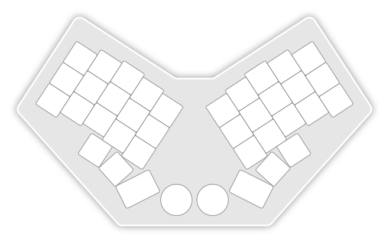
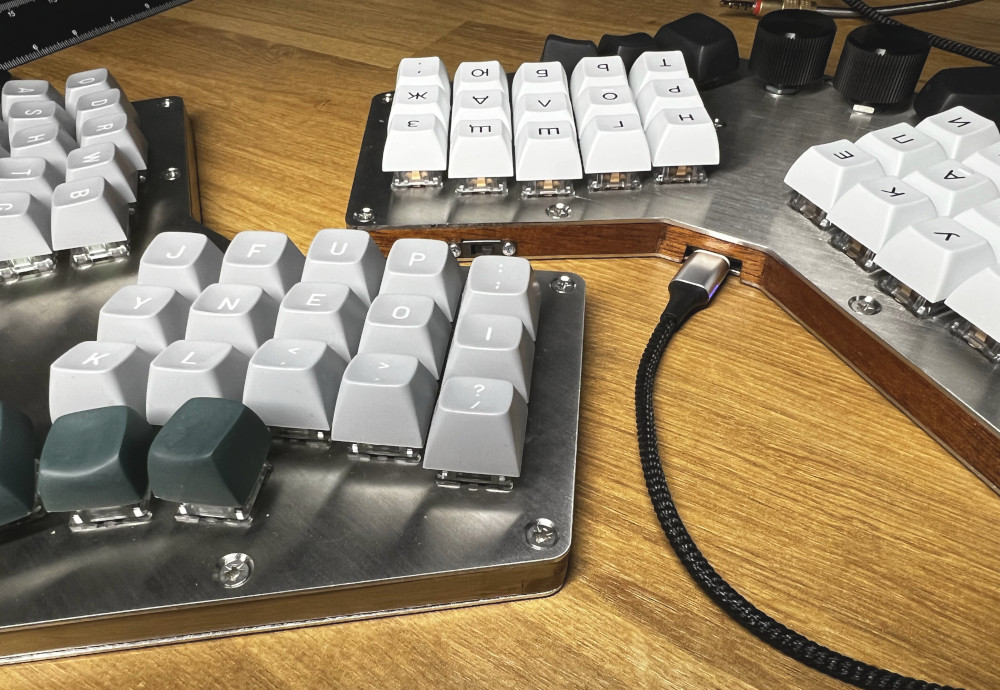
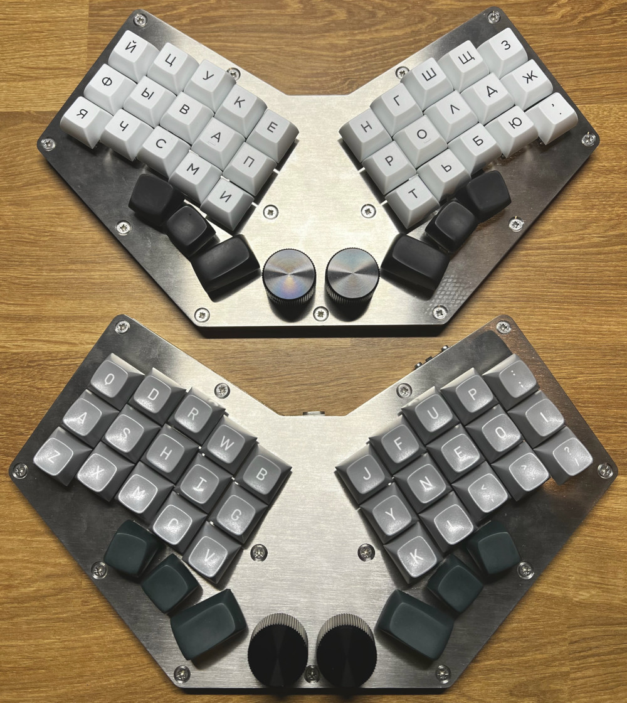

# Cornetto

This is a custom and DIY mechanical keyboard based on my own preferences and observations, handmade from scratch. Foundationally, it borrows many design concepts from the excellent layout of the [Corne keyboard by foostan](https://github.com/foostan/crkbd), which I have used daily for several years. In particular, it is a staggered columnar layout, with the stagger and thumb cluster following the same relative postitions as the Corne. However, it has one fewer column on each hand than a standard Corne, is unibody with the halves angled ergonomically inwards, and two rotary encoders have been added.

In summary; a custom unibody Corne-inspired mechanical keyboard with encoders.

You can read the full [design criteria](/docs/design_criteria.md) and read through the [build guide](/docs/build_guide.md) if you're interested in building this, or a similarly designed board. Below are some photos of the completed boards.

